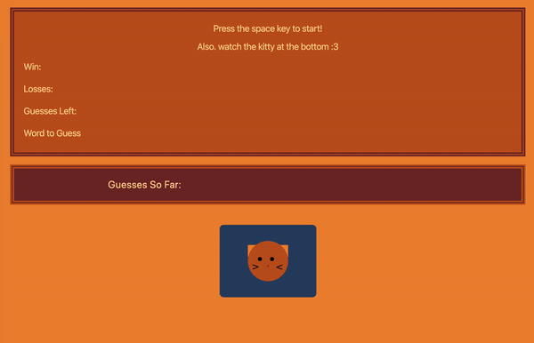

# Word-Guess-Game
Word Guess Game is a simple game where the player tries to guess a word.

[Link to page](https://reekamaharaj.github.io/Word-Guess-Game/)

## Description
The computer picks a word and the user has a 10 tries to guess the word. The words are related to cats. Watch the little kitties reaction while you play. (Kitty is built with CSS)

## Tech used
- HTML
- Tailwind CSS 
- Javascript
- Visual Studio

## Audio source
[Audio File from](https://www.zapsplat.com/music/cat-meow-2/)

## Role in Development
Functionality and Design
